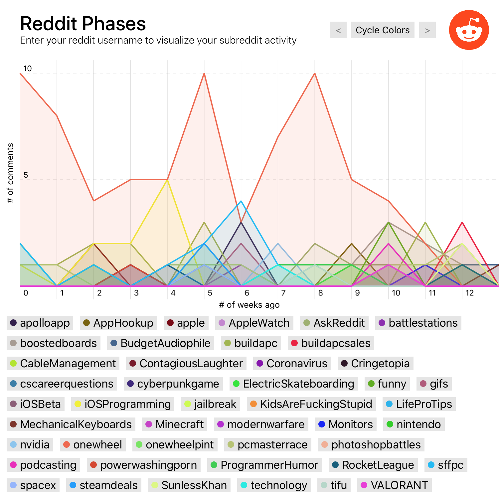

# Reddit Phases
View your reddit comment history by phases of subreddit activity

### How To Use
0. Ensure you're running Xcode 11.4.1 or later
    - May get *"expression failed to parse, unknown error"* when running previous versions  
1. Download the repo and open the playground file
2. Replace YOUR_REDDIT_USERNAME at the top of the file with any valid username
3. Modify the period, maxComments, and filters to customize the output
    - Why a max of 1000 comments? Sorry, reddit api limit!
4. Enjoy!

---

#### This was a  fun project to work on! Here are some of the accomplishments.
- Use of reddit api to fetch any user's comment history (no OAuth!)
    - Recursive callbacks with after param to return up to 1000 comments
- Easy json parsing to model objects using Codable
- Dictionary data grouping by given period (day, week, month, etc)
- Learning to graph with the lightweight SwiftChart library
- UICollectionView for subreddit selection
    - Designing custom, self-sizing cells
- Improved familiarity with Xcode Playgrounds

#### Open Source Dependencies
Thank you to gpbl for [SwiftChart](https://github.com/gpbl/SwiftChart) and mischa-hildebrand for [AlignedCollectionViewFlowLayout](https://github.com/mischa-hildebrand/AlignedCollectionViewFlowLayout). Adopting both libraries made it much easier to focus on the core of this project!
